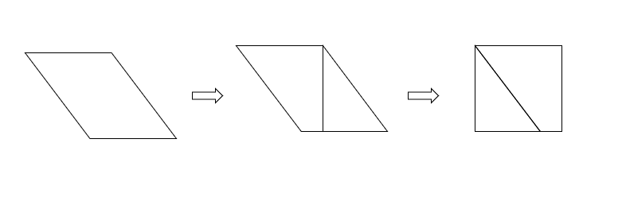
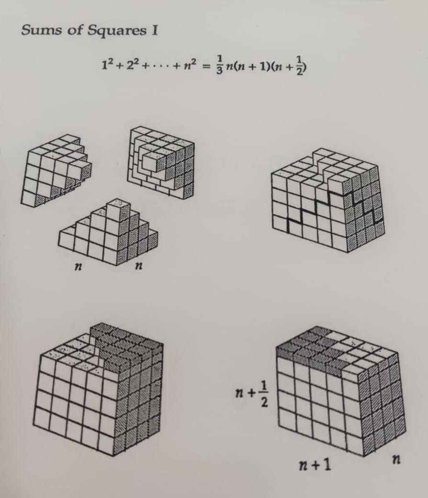

# Mathematical proofs with cardboard and paper

In this tutorial, we'll show visual mathematical proofs using cardboard and paper. This ludic technique is especially good for children. These math proofs are like puzzles, and, best of all, you can do it yourself, at home.

The tutorial is divided into two parts: 2D puzzles, with cardboard; and 3D puzzles, with origami paper!

Authors:
- Arnaldo Gunzi
- Ernée Kozyreff Filho

# Part 1: 2D Puzzles

## The identity $(A+B)^2 = A^2 + 2AB + B^2$.

Start by drawing a square with side length $(A+B)$:

By using cardboard paper to build such a square, divide it into four pieces as follows:

- One square with side length $A$
- One square with side length $B$
- Two rectangles with side lengths $A$ and $B$

The following picture can be used to show more explicitly the relation of the pieces to children and demonstrate that $(A+B)^2 = A^2 + 2AB + B^2$.

## The sum of the internal angles of a triangle is $180^\circ$.

Cut any triangle out of a plate of cardboard paper. In this example, we will use a right triangle and an obtuse triangle.

Cut out two acute angles of the triangles and place them side by side with the remaining angle using a ruler to support them.

It's easy to see that the sum of internal angles is indeed $180^\circ$ in both cases.

## The Pythagorean theorem

The famous Pythagorean theorem $A^2 + B^2 = C^2$ can be a fun puzzle. In this example, we will use a $3-4-5$ right triangle and visualize the relationship $3^2 + 4^2 = 5^2$.

On a piece of cardboard, draw the triangle and three squares using the sides of the triangle as one side of each square. Then cut out the squares, as shown below.

Divide the bigger $5 \times 5$ square into 25 little $1 \times 1$ squares, and fit the pieces in the hypotenuse square.

Now take the little squares and fit them into the legs squares, showing visually that the area of the hypotenuse square is equal to the sum of the areas of the legs squares.

## Calculating the value of $\pi$

We now want to compute an approximate value for $\pi$ using the relationship $C = 2 \pi r$, where $C$ is the circumference and $r$ is the radius of a disc.

Start by cutting out a disc and wrap a piece of rope around it, as shown below.

Measure the radius of the disc (in this case, we got approximately $r = 2.75$ mm).

Now measure the circumference of the disc (in this case, we got approximately $C = 17.2$ mm).

By substituting these values in the formula $C = 2 \pi r$, we have:

$2 \cdot \pi \cdot 2.75 = 17.2$

Finally, we can solve for $\pi$:

$\pi \approx 3.127$

This value is close to the actual one, and with more skilled measurements we can probably get better estimates.

## The geometric series $\frac12 + \frac14 + \frac18 + \frac{1}{16} + \ldots = 1$.

The series $\frac12 + \frac14 + \frac18 + \frac{1}{16} + \ldots$ can fit into a square of size $1 \times 1$.

Using cardboard paper, we can replicate this figure up to a certain point. In this example, we go as far as the term $\frac{1}{32}$:

You can also rearrange the pieces to see more clearly the relation of the sizes of the pieces.

## Sum of odd integers $1 + 3 + 5 + \ldots + (2n+1) = n^2$.

Here, we will illustrate the case where $n = 4$, i.e., we will visualize the identity $1 + 3 + 5 + 7 = 4^2$.

Cut L-shaped strips with sizes proportional to the numbers 1, 3, 5, 7, as follows.

Now combine the 4 pieces to form a square of side measuring 4.

The area of the square is 16.

## The identity $(A+B+C)^2 = A^2 + B^2 + C^2 + 2AB + 2AC + 2BC$.

Similar to what we did with $(A+B)^2$, start by drawing a square with side length $(A+B+C)$:

Use cardboard paper to build such a square and divide it into four pieces as follows:

- One square with side length $A$
- One square with side length $B$
- One square with side length $C$
- Two rectangles with side lengths $A$ and $B$
- Two rectangles with side lengths $A$ and $C$
- Two rectangles with side lengths $B$ and $C$

Put the pieces side by side as shown below to see more clearly the relationship $(A+B+C)^2 = A^2 + 2AB + 2AC + 2BC + B^2 + C^2$:

# Part 2: 3D puzzles with origami cubes

The building blocks for the 3D puzzles are the traditional Sonobe units for modular origami. You can find a tutorial on how to build them here:

[https://www.thesprucecrafts.com/modular-origami-cube-box-4082281](https://www.thesprucecrafts.com/modular-origami-cube-box-4082281)

Some of these modular units are displayed below.

We can do more cubes like this, and glue them together to make the pieces of our puzzle.

## The identity  $(A+B)^3 = A^3 + 3A^2B + 3AB^2 + B^3$.

We can visualize the above formula using 3D cubes.

In our example, we take $A = 2$ and $B = 1$, so we have a $2 \times 2 \times 2$ cube, three $2 \times 24 \times 1$ cuboids, three $1 \times 1 \times 2$ cuboids, and one $1 \times 1 \times 1$ cube.

These pieces form a $3 \times 3 \times 3$ cube, as shown below.

PS: To assemble the puzzle for this example, we used, in total, 27 unit cubes. For each cube we need 6 pieces of paper, resulting in 162 pieces of paper, glue, and a lot of patience! 😵

## Suggestions

You can also try to build other visual proofs at home.

### Prove that the area of a parallelogram is equal to basis x height.

### The Pythagorean Theorem: there are several other visual proofs. The one below is particularly interesting and easy to do.

### Sum of quarters: in the same spirit as the presented proofs, the sum of quarters is interesting to be done in a cardboard puzzle format.

### Fibonacci: this beautiful sequence can be visualized using squares of sizes 1, 1, 2, 3, 5 and so on.

### Sum of squares $1^2 + 2^2 + 3^2 + \ldots + n^2 = \dfrac{n (n+1) (n+2)}{3}$

There is a beautiful proof of the sum of first $n$ positive integers squared. We need three pyramidal cubes of shapes as shown below. With them, we can form the shape as in the proof.

(Source: see reference 1 below.)

It is not easy to visualize a 3D shape. Having the pieces in hand can make the visualization and comprehension of the formula much easier.

# References and Links

1. Nelsen, Roger. Proofs without Words: exercises in visual thinking. Washington DC: The Mathematical Association of America, 1993.

2. Nelsen, Roger, Proofs without words II: more exercises in visual thinking. Washington, DC: The Mathematical Association of America, 2001.

3. [https://ideiasesquecidas.com/laboratorio-de-matematica/](https://ideiasesquecidas.com/laboratorio-de-matematica/)

